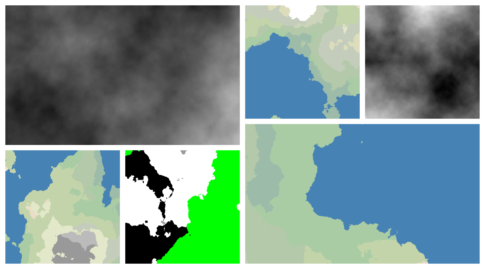

## About ##

This is heightmap generator, that was implemented using *Diamond Square algorithm*. It can build heightmaps for ***3D*** worlds. Just type `python3 grph.py --help` in console if you want to generate simple image!

## What is requirements? ##

You have to install `numpy`. If you want to use `grph.py`, install `PIL`.
